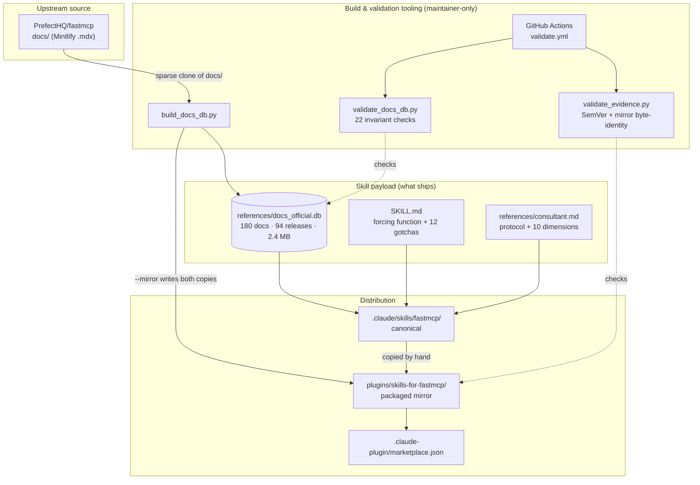
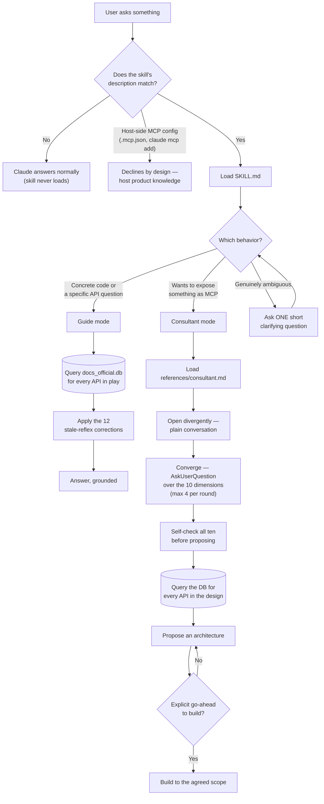
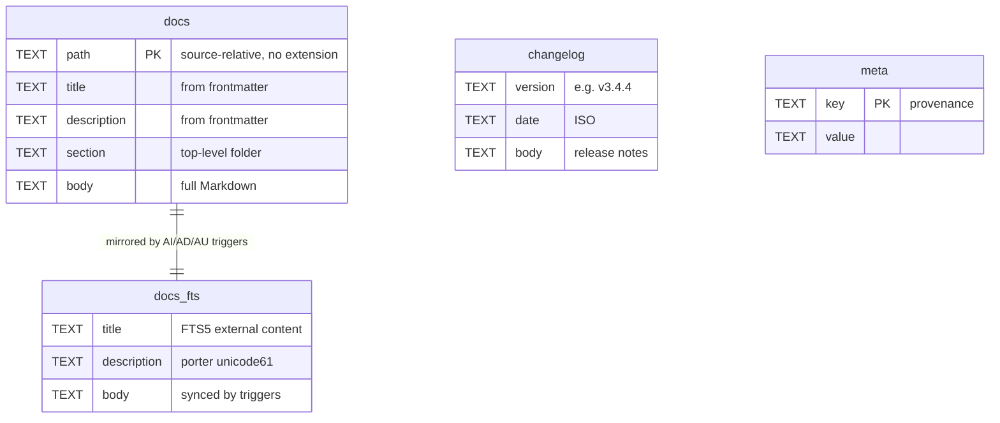
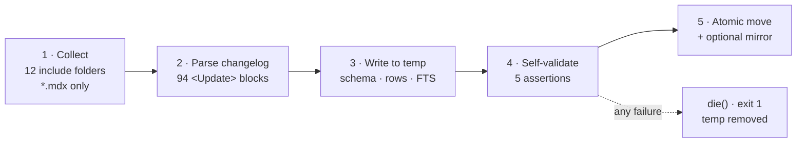
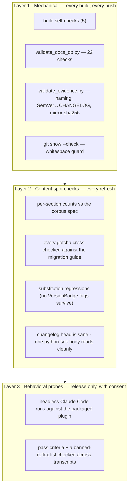

# Architecture

*How the project is built: the components, how a question flows through them, how the database
is produced, and why each piece is shaped the way it is.*

## The big picture

Three subsystems with different lifetimes. The **payload** is what users install. The **tooling**
produces and guards the payload. The **plans** record why any of it looks the way it does.



The dotted lines are the part worth noticing: nothing validates the *content* of the
documentation, because it is upstream's. What is validated are the **invariants of the
artifact** — that it has the right shape, the right size, no excluded material, and an exact
twin in the plugin directory.

## Repository map

| Path | What lives there |
|---|---|
| `.claude/skills/fastmcp/` | **The canonical skill.** The source of truth for the payload. |
| `plugins/skills-for-fastmcp/` | **The packaged plugin.** A byte-identical copy of the skill plus a `plugin.json` manifest. |
| `.claude-plugin/marketplace.json` | Makes the repository installable as a marketplace. |
| `scripts/` | The three Python scripts. Standard library only — no dependencies, so CI needs no install step. |
| `.github/workflows/validate.yml` | CI: both validators plus a whitespace guard. |
| `docs/wiki/` | This documentation. |
| `docs/plans/initial-build/` | The design record: decisions D1–D12, corpus spec, validation plan, and release evidence. |
| `.claude/harness-spec.md` | Component inventory and drift anchor. |
| `.tmp/` | Build scratch space for upstream clones. Git-ignored — build inputs never enter the repository. |

## How a question flows through the skill



Two structural choices are visible here.

**The query step is not optional and not conditional.** It sits on the path of both behaviors,
before anything is produced. This is the [forcing function](Concepts.md#the-forcing-function):
the skill removes the model's basis for confidence rather than adding a resource beside it.

**The consultant has an agreement gate.** Design is free and always offered; writing files is
gated on an explicit "yes, build it." Enthusiasm for a design is not consent to write it.

## The database

One SQLite file, four tables.



```sql
CREATE TABLE docs (
    path        TEXT PRIMARY KEY,
    title       TEXT,
    description TEXT,
    section     TEXT,
    body        TEXT NOT NULL
);
CREATE INDEX idx_docs_section ON docs(section);

CREATE VIRTUAL TABLE docs_fts USING fts5(
    title, description, body,
    content='docs', content_rowid='rowid',
    tokenize='porter unicode61'
);

CREATE TABLE changelog (version TEXT, date TEXT, body TEXT);
CREATE INDEX idx_changelog_date ON changelog(date);

CREATE TABLE meta (key TEXT PRIMARY KEY, value TEXT);
```

Three design points:

- **`docs_fts` is an external-content table.** It indexes `docs` rather than duplicating it —
  the body text is stored once. Three triggers (`docs_ai`, `docs_ad`, `docs_au`) keep the index
  synchronized on insert, delete, and update.
- **The changelog is a table, not a document.** Upstream's `changelog.mdx` is a 352 KB file of
  94 `<Update>` blocks. Stored as a single document row it would be a useless search result;
  parsed into rows it answers "what changed recently, and how current is this snapshot?" with an
  `ORDER BY date DESC`.
- **`meta` makes the artifact self-describing.** Provenance travels with the database, so a
  question about currency has an answer that does not depend on remembering which snapshot you
  installed.

Shipped contents (v1.0.0): **180** documents, **94** releases, **2,428,928 bytes**, ~1.35 M
characters of body text.

## The build pipeline

`scripts/build_docs_db.py` transforms a documentation checkout into the database, in five
logged stages:



Per file, the transformation is: split YAML frontmatter → resolve JSX snippet components →
strip GitHub source-link decorations from `python-sdk` pages → derive `path`, `title`,
`description`, `section` → store the body. The build finishes by optimizing the FTS index and
running `VACUUM`, which is why 1.35 M characters land in 2.4 MB.

### Two decisions worth understanding

**Snippets are transformed or dropped, never recursively inlined.** FastMCP's `/snippets/*.mdx`
files are JSX *component definitions*, not content fragments. Inlining them would splice
JavaScript into the corpus. Instead each of five known components has a rule: `<VersionBadge
version="3.0.0" />` becomes the searchable text `*New in version 3.0.0*`; two static tip
components become their plain text; two display-only components are dropped.

The important part is the failure mode. If upstream adds a snippet component the script does not
recognize, **the build dies rather than shipping a document with a raw JSX tag in it**. An
unknown snippet is a signal that upstream changed, and a signal is worth more than a
best-effort guess.

**The build is atomic.** The database is written to a temporary file, self-validated, and only
then moved into place. A failed build leaves the previous database untouched — you can never
ship a half-built artifact.

### Fail-fast conditions

| Condition | Why it fails rather than warns |
|---|---|
| SQLite lacks FTS5 | The whole database would be unsearchable |
| `--src` has no `servers/` directory | Wrong directory passed |
| Any of the 12 include folders missing | Upstream restructured — re-examine before ingesting |
| Unknown snippet component | Upstream added one; raw JSX would leak into a body |
| Import line or render tag survives substitution | The transformation silently failed |
| Fewer than 80 `<Update>` blocks | Changelog format changed upstream |
| Document count outside 150–220 | The include list or upstream layout changed materially |
| FTS smoke query returns nothing | The index did not build |
| Any of the six `meta` keys missing | The artifact would not be self-describing |

## Validation

Three layers, cheapest first. Layers 1 and 2 are mandatory before release; layer 3 requires the
maintainer's consent because it spends real tokens.



**What `validate_docs_db.py` checks** (22 in total): all four tables exist; the document count
falls in the 150–220 band *and* equals the recorded `meta.doc_count`; at least 80 changelog rows
with the newest version matching `v3.`; zero surviving snippet import lines; zero `v2/` and zero
`apps/` documents; zero surviving `<VersionBadge` tags; two content anchors present
(`servers/providers/skills` must contain `SkillsDirectoryProvider`, and the 2→3 migration guide
must contain `on_duplicate`); two FTS probes returning rows; and all six `meta` keys populated.

**What `validate_evidence.py` checks**: plugin and marketplace names agree and point at the right
source; the plugin version has a matching `## [x.y.z]` heading in `CHANGELOG.md`; and every file
in the canonical skill has a byte-identical twin in the plugin mirror, compared by SHA-256 —
including the 2.4 MB database. That last check is the teeth of the mirror rule.

**What CI runs.** `validate.yml`, on every push and pull request, on Python 3.12: both
validators plus `git show --check HEAD`. Note it **validates but never rebuilds** the
database — the `.db` is a committed artifact, so whoever regenerates it commits the result.

## Design decisions and their rationale

Every decision from the initial build is recorded as D1–D12 in
[`docs/plans/initial-build/00-goals-and-decisions.md`](../plans/initial-build/00-goals-and-decisions.md).
The ones that most shape the architecture:

**Why a full-corpus database instead of a hand-written cheat sheet.** A curated summary drops
whatever its author did not think to include, and the omissions are invisible. It also cannot be
refreshed — only rewritten, re-exercising the same judgement. A snapshot of the whole corpus is
refreshed by re-running a script.

**Why 2.x documentation is excluded.** Including it would reproduce, inside the database, the
exact staleness the database exists to cure. A search for `mount` returning both a 2.x and a 3.x
answer is worse than one returning only the current answer. The single exception is the official
2→3 migration guide, which is the sanctioned way to reason about 2.x code.

**Why the schema matches the sibling Skills-for-Langchain project.** One mental model across
skills, validators, and any future tooling. The corpus dialect differs; the shape does not.

**Why the tooling is forked rather than shared.** With two repositories and divergent
documentation dialects, a shared library would be a speculative abstraction serving two
consumers. Forking three scripts and adapting them is cheaper than generalizing them — and each
copy stays readable.

**Why generality was deliberately deleted.** The upstream LangChain build script carried
language-conditional stripping and recursive snippet inlining. Neither applies to FastMCP
(Python-only; JSX component snippets), so both were removed rather than left in as dead
branches. Dead generality is a maintenance trap: it looks load-bearing and nobody dares delete
it later.

**Why the skill exists at two paths.** The repository is simultaneously the development home of
the skill and a distributable plugin marketplace. Both roles need a copy. A symlink would not
survive packaging, so the copies are duplicated and their identity is enforced mechanically
rather than by discipline.

---

**Next:** [Usage-Guides](Usage-Guides.md) to put it to work, or
[Coverage-and-Limits](Coverage-and-Limits.md) for exactly what the corpus contains.

[← Back to the documentation index](README.md)
